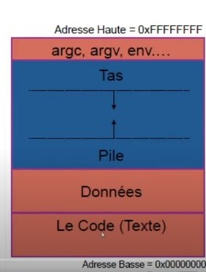
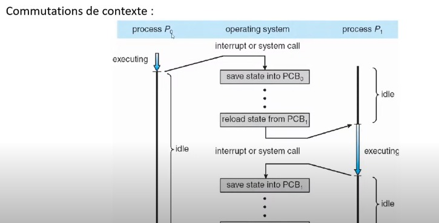
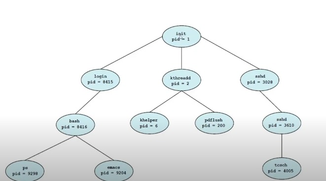

# cour 02 : Processus

## I. Processus 

### 1. Processus :

#### a. Definitions :

- **Action atomique** : exécution d’une instruction assembleur , qui ne peut pas étre interrompu.

- **Points observables :** ont référence aux moments ou aux événements auxquels les états ou les comportements du système ou des processus peuvent être observés, mesurés ou analysés. 

- **Processus (séquentiel) :** suite d’actions, Un processus correspond à l’exécution d’un  programme

- **Contexte:** ensemble des informations que les actions d’un processus peuvent consulter ou  modifier.

- **PID :** : un numéro unique attribué à chaque processus en cours d'exécution dans un système d'exploitation.

- **processus (Concrètement) :** 
     
    Les éléments suivent  forment la base d'un processus et permettent à l'ordinateur d'exécuter des programmes de manière efficace et concurrente:
        
    1. **Un Espace Mémoire** : 
        - Chaque processus dispose de son propre espace mémoire dédié. 
        - Cet espace mémoire contient : les données, le code exécutable (programme) et la pile d'exécution du processus. 
        - L'espace mémoire est divisé en plusieurs sections: 
            - le segment de texte (code), 
            - le segment de données (variables globales), 
            - le segment de pile (pour les appels de fonctions) 
            - et d'autres segments selon le système d'exploitation.

    2. **Un Compteur Ordinal (PC - Program Counter)** : 
        - Le compteur ordinal est un registre spécial qui indique l'adresse mémoire de l'instruction actuellement en cours d'exécution dans le code du programme

    3. **Des Registres Généraux** : 
        - Un processus a accès à un ensemble de registres généraux dans le CPU. 
        - Ces registres sont utilisés pour stocker des données temporaires, des résultats intermédiaires et des valeurs d'index pour les opérations. 
        - Le nombre et la taille des registres varient en fonction de l'architecture du processeur.



#### b. Création-Activation d'un Processus : 


Les étapes de la création de exécution d'un processus :

1. **Créer un Processus** :
   - Lors de la création d'un processus, le système d'exploitation alloue un espace mémoire pour le processus. Cet espace comprend généralement des segments de code, de données et de pile.

   - Le point de départ du processus est défini par l'emplacement du code exécutable dans l'espace mémoire du processus. Le système d'exploitation attribue une adresse de départ à la section de code.

2. **Lancer l'Exécution du Processus** :

   - Le chargement du compteur ordinal (PC) se fait en définissant le PC sur l'adresse de départ du code du processus. Cela indique où le processus doit commencer son exécution.

   - Les registres généraux du CPU sont initialisés selon les besoins du processus. Les valeurs initiales des registres peuvent être définies en fonction des paramètres du processus.

3. **Exécution du Processus** :
   - Une fois lancé, le processus commence à exécuter les instructions à partir de l'adresse de départ définie par le PC. Le système d'exploitation gère l'ordonnancement des processus pour leur accorder du temps CPU.

4. **Arrêter un Processus** :
   - Lorsque le processus se termine ou est interrompu, le système d'exploitation peut ranger les valeurs des registres, notamment l'état des registres généraux.
   - Le système d'exploitation peut également libérer l'espace mémoire alloué au processus pour le rendre disponible à d'autres utilisations.


#### C. Destruction d’un processus :

La destruction ou la terminaison d'un processus peut se produire de plusieurs manières dans un système d'exploitation. Voici trois scénarios courants :

1. **Fin Normale d'Exécution** :

   - Dans ce scénario, un processus se termine normalement à la fin de sa tâche ou de son exécution. Par exemple, un traitement de texte se termine lorsque l'utilisateur ferme l'application après avoir enregistré son travail. Le processus effectue ses opérations de nettoyage et se ferme proprement.

   - La terminaison normale est souvent précédée d'une libération des ressources allouées, de la fermeture de fichiers ouverts et de la libération de la mémoire.

2. **Erreur Fatale** :

   - Parfois, un processus peut rencontrer une erreur fatale ou une condition exceptionnelle qui ne peut pas être gérée. Dans ce cas, le processus peut se terminer de manière anormale. Par exemple, un programme peut accéder à une zone mémoire interdite et provoquer une erreur de segmentation (segmentation fault) qui entraîne la terminaison immédiate du processus.

   - Lorsqu'une erreur fatale se produit, le système d'exploitation peut générer un rapport d'erreur pour aider à diagnostiquer le problème.

3. **Destruction par un Autre Processus** :

   - Un processus peut être détruit par un autre processus si ce dernier envoie un signal approprié pour demander la terminaison du processus cible. 

    - Par exemple : 
        un administrateur système peut envoyer un signal SIGKILL (``kill`` en unix) à un processus problématique pour le forcer à se terminer immédiatement.


##### RQ :

- un programme peut étre éxecutez par plusiéres processus.


#### D. Relations entre processus :


- **Exécution** :

1. **Pseudo-parallèle** :
   - Dans un système mono-processeur, l'exécution de plusieurs processus se fait en utilisant des interruptions et une commutation de contexte rapide pour donner l'illusion de parallélisme. Le CPU bascule rapidement entre les processus, ce qui crée une impression de pseudo-parallélisme.

2. **Parallèle** :
   - Sur des systèmes multi-processeurs ou multi-cœurs, plusieurs processus peuvent s'exécuter véritablement en parallèle, chaque processeur ou cœur exécutant un processus différent simultanément.


- **Ressources et Compétition entre Processus** :

   - Les processus peuvent concourir pour l'accès à des ressources virtuelles telles  la mémoire, les fichiers, les connexions réseau, etc.
   - Les systèmes d'exploitation utilisent des algorithmes de planification pour allouer équitablement le temps CPU aux processus concurrents et gérer l'accès aux autres ressources.


- **Accès à des Données Partagées** :

1. **Exclusion Mutuelle** :
   
   - Lorsque plusieurs processus accèdent à des ressources partagées, il est essentiel de mettre en place des mécanismes d'exclusion mutuelle pour éviter les conflits. 
   
   - L'exclusion mutuelle garantit qu'un seul processus à la fois peut accéder à la ressource partagée.
   


2. **Synchronisation** :

   - Les processus peuvent avoir besoin de se synchroniser pour coopérer ou coordonner leurs activités. 
   
   - La synchronisation est importante pour éviter des conditions de concurrence indésirables.


#### E. Etats d'un processus :

1. **État Élu (Running)** :

   - L'état "Élu" ou "Running" désigne le moment où un processus est actuellement en cours d'exécution par le processeur (CPU). C'est-à-dire que le CPU exécute les instructions du processus, et celui-ci est en train de s'exécuter activement.

2. **État Bloqué (Blocked)** :

   - Lorsqu'un processus ne peut pas continuer son exécution car il attend une ressource ou une condition particulière (comme une entrée/sortie, une opération de lecture/écriture sur disque, une réponse à une requête réseau, etc.), il entre dans l'état "Bloqué". 
   - Dans cet état, le processus ne peut pas utiliser le temps CPU et doit attendre que la ressource ou la condition soit satisfaite.

3. **État Prêt (Ready)** :

   - L'état "Prêt" ou "Ready" est celui où un processus est prêt à être exécuté par le CPU. Cependant, il n'est pas actuellement en cours d'exécution (état "Élu"), car le CPU est peut-être occupé à exécuter un autre processus. 
   
   - Les processus en attente dans cet état sont prêts à être sélectionnés pour l'exécution dès que le CPU sera disponible.


##### RQ :

un processus ne peut pas passer de l'état `Ready` vers l'état `blocked`.


### 2. PCB :

Un PCB, ou Process Control Block (Bloc de Contrôle de Processus), est une structure de données essentielle utilisée par un système d'exploitation pour gérer les processus en cours d'exécution sur un ordinateur

#### a. Définition :

   - lors des opérations de commutaion de context le SE doit sauvgarder /restaurer le context mémoire et le context  processeur.

   - le SE crée alors le BLOC de control du processus ``PCB`   qui est une structure de description du processus  associé au programme exécutable.


#### b. Contenu  d'un PCB :

Le contenu exact d'un PCB peut varier en fonction du système d'exploitation, mais il contient généralement des informations importantes pour la gestion des processus :

1. **Identifiant du processus (PID - Process ID)** : Un numéro unique attribué à chaque processus en cours d'exécution. Il permet au système d'exploitation de faire référence à un processus spécifique.

2. **État du processus** : Il indique l'état actuel du processus, tel que prêt, en attente, en cours d'exécution, suspendu, terminé, etc. Cela aide le système d'exploitation à gérer la planification des processus.

3. **Registres de processeur** : Les valeurs des registres du processeur du CPU sont sauvegardées dans le PCB lorsque le processus est interrompu. Ces valeurs sont restaurées lorsque le processus reprend son exécution.

4. **Compteur de programme (PC)** : Il contient l'adresse de l'instruction à exécuter lorsque le processus reprend son exécution.

5. **Pointeur de pile (SP)** : Il pointe vers la position actuelle de la pile du processus. La pile est utilisée pour gérer les appels de fonction et les données locales.


6. **Liste des fichiers ouverts** : Les descripteurs de fichiers ouverts par le processus sont souvent stockés dans le PCB. Cela permet de conserver l'état des fichiers ouverts par le processus.





### 3. Gestion de processus sur Unix :

#### a. L'arbroressence de processus :

- L'arborescence de processus (ou la hiérarchie de processus) en UNIX est une structure organisée des processus où un processus parent peut créer des processus enfants, formant ainsi une hiérarchie. 

1. **Processus Racine** : Au sommet de l'arborescence se trouve le processus racine (souvent avec le PID 1), qui est le premier processus créé lors du démarrage du système d'exploitation. Ce processus est responsable de l'initialisation du système et de la gestion des autres processus.

2. **Processus Parent et Processus Enfant** : Un processus parent peut créer un ou plusieurs processus enfants. Le processus parent est celui qui a créé le processus enfant. Les processus enfants héritent souvent de certaines caractéristiques de leur parent, tels que l'environnement, le répertoire de travail, etc.

3. **Terminaison et Adoption** : 
   - Lorsqu'un processus enfant se termine (volontairement ou en raison d'une erreur), il informe son parent de sa terminaison. À ce moment-là, le processus parent peut effectuer des opérations de nettoyage, récupérer des informations sur la terminaison de l'enfant, etc. 
   - Les processus orphelins (c'est-à-dire ceux dont le parent se termine avant eux) sont souvent "adoptés" par le processus init (PID 1).




#### b. la structure d'un processus sur UNIX `task_struct` :

La structure `task_struct` est définie dans le noyau Linux dans le fichier d'en-tête "include/linux/sched.h"
 

```c
#include <linux/sched.h>

struct task_struct {
    
    pid_t pid
     ; // identifaint du processus 
    
    long state;  // État du processus

    struct task_struct *parent ; // le parent du processus 

    struct list_head children ; // les enfants de ce processus 

    // ... 
};
```


### 4. manipulation de processus en C : 


- En C, la manipulation de processus peut être effectuée en utilisant plusieurs fonctions système, notamment `fork()`, `exec()`, `wait()`, et `exit()`
- Ces fonctions vous permettent de créer, exécuter, attendre et terminer des processus. Voici quelques-unes de ces fonctions avec des exemples et des explications :

1. **`fork()`** :  
   
   - `fork()` crée un nouveau processus fils en dupliquant le processus parent. 


   - `fork()` retourn un pid `pid_t`  : Dans le processus parent, la valeur de retour de fork() sera le PID du processus fils. Dans le processus fils, la valeur de retour sera 0.

   - Exemple : 

```c
         #include <stdio.h>
         #include <unistd.h>

         int main() {
            pid_t pid = fork();

            if (pid < 0) {
               printf("fork Errure ");
               return 1;
            }

            if (pid == 0) {
               printf("Je suis le processus fils\n");
            } else {
               printf("Je suis le processus parent\n");
            }

            return 0;
         }
```

2. **`exec()`** : 

   - La fonction `exec()` est en réalité une famille de fonctions qui sont utilisées pour exécuter un nouveau programme à l'intérieur d'un processus existant. 
   
   - Ces fonctions remplacent le code du processus actuel par celui du nouveau programme spécifié. Les fonctions de la famille `exec()` comprennent :

      - `execl()`: Exécute un programme avec une liste d'arguments passée en tant qu'arguments de la fonction.
         
      - `execp()`: Exécute un programme à partir du répertoire de recherche de fichiers exécutables.
         
      - `execv()`: Exécute un programme avec des arguments passés sous forme de tableau.
         
      - `execvp()`: Exécute un programme à partir du répertoire de recherche de fichiers exécutables, avec des arguments passés sous forme de tableau.
         
      - `execle()`: Exécute un programme avec des arguments et un environnement spécifiés.
         
      - `execve()`: Exécute un programme avec des arguments, un environnement spécifié et un chemin d'accès complet au fichier exécutable.


   - Exemple :

```c
   #include <stdio.h>
   #include <unistd.h>


   int main(void)
   {

      // on va tester la famille de fonction exce() en partuiclier execl 

      printf("le procesus exécute mnht cette ligne !!!!!! \n");

      // si on appelle la fonction excel() : l'éxceutable tst sear éxécuter 
      execl("../01_introduction/tst","tst" ,NULL); 
      
      // execl("repértoire_de_exécutable/nom ,"arg1","arg2,....,NULL"); NULL : pour indique la fin des arguments 

      // la partie qui reste de cette code sera ignoré :
      printf("je sera ignoré !!!!! \n");


      return 0 ;
   }
   
```


3. **`wait()`** : 

   - La fonction `wait()` permet au processus parent d'attendre la terminaison de son processus fils. 
   
   - Elle est souvent utilisée pour synchroniser les processus. 
   
   - Voici un exemple :

 ```c
      #include <stdio.h>
      #include <unistd.h>
      #include <sys/wait.h>

      int main() {
         pid_t pid = fork();

         if (pid < 0) {
            perror("fork");
            return 1;
         }

         if (pid == 0) {
            printf("Je suis le processus fils\n");
         } else {
            printf("Je suis le processus parent\n");
            wait(NULL); // Attendre que le processus fils se termine
            printf("Le processus fils s'est terminé\n");
         }

         return 0;
      }
```

4. **`exit()`** : 
   
   - La fonction `exit()` permet à un processus de se terminer. 
   
   - Elle prend un code de retour en argument pour indiquer si le processus s'est terminé avec succès ou avec une erreur. 
   
   - Voici un exemple :

```c
      #include <stdio.h>
      #include <stdlib.h>

      int main() {
         int status = 42; // Code de retour arbitraire
         printf("Processus en cours d'exécution\n");
         exit(status);
      }
```


### 5. Ordonnanceur :

#### a. Définition :


**L'ordonnanceur :** 
   - est une composante essentielle du noyau d'un système d'exploitation. 
   - Il est responsable de la gestion des processus et de la répartition du temps CPU entre eux. 
   - L'objectif principal de l'ordonnanceur est de garantir une utilisation efficace des ressources du système tout en respectant les objectifs de performance du système.

#### b.  QQ points sur L'Ordonnanceur :

1. **Répartition du Temps CPU** :
   - L'ordonnanceur répartit le temps CPU entre les processus prêts à s'exécuter. 
   - Il décide quel processus sera exécuté ensuite et pendant combien de temps.

2. **Stratégie d'Ordonnancement** :
   - L'ordonnanceur utilise une stratégie d'ordonnancement pour déterminer l'ordre dans lequel les processus seront exécutés. Cette stratégie peut varier en fonction des objectifs du système.
   - Les stratégies d'ordonnancement visent généralement à optimiser des critères tels que le temps de réponse, le débit des travaux, l'utilisation du CPU, etc.

3. **Algorithmes d'Ordonnancement** :


   - **Les algorithmes non-préemptifs :** 
      - permettent à un processus de s'exécuter jusqu'à ce qu'il se termine ou qu'il soit bloqué. 

      - L'ordonnanceur ne peut pas interrompre un processus en cours d'exécution.
   
   - **Les algorithmes préemptifs:** 
      - permettent à l'ordonnanceur d'interrompre un processus en cours d'exécution pour donner la priorité à un autre processus. 
      
      - Cela permet une réactivité plus rapide aux changements de contexte.


## II. synchronisation  entre processus :


### 1. Définition et Carctéristques :

- La synchronisation entre processus est un concept clé en programmation concurrente et en systèmes d'exploitation. 

- Elle vise à coordonner l'exécution de plusieurs processus de manière à éviter les conflits et à assurer une exécution correcte et prévisible des tâches. 

- Voici quelques aspects importants de la synchronisation entre processus :

1. **Points de synchronisation** : Les points de synchronisation sont des endroits dans le code où les processus doivent se coordonner les uns avec les autres. Les points de synchronisation sont généralement utilisés pour garantir l'ordre d'exécution, partager des données entre les processus ou éviter des conditions de concurrence.

2. **Contraintes : conditions de franchissement** : Pour qu'un processus puisse franchir un point de synchronisation, il doit souvent respecter certaines conditions.cette condition s'appelle la condition de franchissement.

3. **Difficultés de programmation et de mise au point** :

   - **Indéterminisme** : Les programmes concurrents peuvent souvent produire des résultats différents à chaque exécution en fonction de l'ordre d'exécution des processus. Gérer cet indéterminisme peut être complexe.

   - **Exclusion mutuelle** : L'exclusion mutuelle est une propriété importante de la synchronisation, garantissant qu'un seul processus à la fois peut exécuter une section critique. La mise en œuvre correcte de l'exclusion mutuelle peut être délicate pour éviter les problèmes de concurrence.


### 2. Les moniteurs : un outil de  synchronisation


#### a. Définition d'un  **Moniteur** 

- **Moniteur** :

   - Un moniteur est une structure de données  qui encapsule des ressource partagée ainsi  des méthodes et des procédures en exclusion mutuelle . 
   
   - Les moniteurs fournissent un mécanisme de synchronisation qui garanti l'exclusion mutuelle et les conditions de synchronisation entre les threads. 

   - si un processus P1 est acitf dans le moniteur ( en exécution d'une méthode du moniteur ) sur un objet et qu 'un autre processus P2 demande l'accées au    moniteur ( invoque une méthode du moniteur) sur ce méme Objet 
   Alors :  
   le P2 est mis en attente du moaniteur jusqu'a ce que P1 libére l'accées.


   - chaque moniteur a une file d'attente `FIFO`.

   - chauqe monietur contient : 

      - **La ressource partagée** : C'est la donnée ou la ressource que les threads souhaitent accéder de manière concurrente.

      - **Opérations de verrouillage/déverrouillage** : Des méthodes ou des fonctions permettant de verrouiller et de déverrouiller le moniteur. Le verrouillage garantit l'exclusion mutuelle, c'est-à-dire qu'un seul thread peut accéder au moniteur à la fois.

      - **Variables de condition** : Des variables associées au moniteur qui permettent aux threads d'attendre ou d'être notifiés lorsque certaines conditions sont remplies.


#### RQ : comment assurer l'exclusion mutuelle ? 

Pour assurere l'exclusion mutuelle , Il suffit de regrouper toutes les **sections critiques** et  toutes les varaiables partagés d'un probleme dans un moniteur.

**section critique :** est une partie du code où plusieurs threads ou processus peuvent accéder simultanément à des données partagées ou à des ressources critiques. 


#### b. **variable de condition :**

- **variable de condition :** 
   
   - sont utilisées en conjonction avec un moniteur pour permettre à un thread de suspendre son exécution jusqu'à ce qu'une condition spécifique soit remplie, ou pour signaler qu'une condition a été satisfaite. 
   
   - il existe deux opérations associées aux variables de condition : ``Wait`` et ``Signal``

      * ``Wait`` : est une opération qui permet à un processus de se mettre en attente jusqu'à ce qu'une condition spécifique soit remplie.

      * ``Signal``: L'opération Signal  est utilisée pour signaler à un ou plusieurs threads en attente qu'une certaine condition a été satisfaite. Cela réveille l'un des threads en attente qui avait précédemment appelé Wait sur la même variable de condition. 


#### RQ **Sémantique de signaler :**

   - Que se passe-t-il quand signaler réveille un  processus  ?
   
      * Sans précaution, deux processus sont actifs  dans le moniteur, celui qui signale et celui  qui est réveillé

      * Le processus qui effectue signaler se bloque  et ne reprendra la main que lorsque le  processus réveillé quitte le moniteu
 


### 3. Exemples :

#### a. Écriture -> lecture : 
   
   - Un processus écrit dans un tampon 
   
   - Un second processus doit prélever le résultat

   - Condition : ``fin(écriture) < début(lecture)``

   - Algo d'un moniteur de sync :

      ```algo
      sync : moniteur;

      var fait:booléen; 
      fini : condition ;

      --initialisation
      fait := faux ;
      

      
      procédure fin_écrire ;
      début
         fait:=vrai; 
         fini.signaler;
      fin ;

      procédure début_lire ;
      si non fait alors: 
         fini.attendre fsi;

      fin sync

      ```

#### b. Rendez-vous:

   -  N processus, chacun avec un point de  rendez-vous .

   - Lorsqu’un processus arrive à son point de  rendez-vous, il se bloque sauf si tous les  autres sont déjà arrivés .

   - Le dernier arrivé débloque tous les autres.

   - Condition d’attente : nb_arrivés < N .

   - Algo de sync :

      ```algo
      rendezvous :moniteur


      var n entier ; 
      tousla :condition;

      --initialisation
      n := 0 ; 


      -- ou une autre maniére  d'implémenter arriver 
      procedure arriver;
      début
      n:=n+1; 
      si n<N alors 
         tousla.attendre;
      else
         while(n >= 0)
            tousla.signaler
            n=n-1;
      
      fin;
      
      fin rendezvous  ;   
      
      
      
      ```

   
#### c. Modèle du producteur et du  consommateur :

   - **Description :**

      Le problème classique du producteur et du consommateur est un exemple courant de synchronisation dans la programmation concurrente. Il implique deux types de processus : les producteurs, qui produisent des données, et les consommateurs, qui consomment ces données. Ces processus partagent un tampon de communication de N cases, où le producteur dépose un message à la fois, et le consommateur retire un message à la fois.

   - **Contraintes de synchronisation :**

      * Soit n le nombre de messages actuellement présents dans le tampon. Cette valeur doit être maintenue et mise à jour de manière cohérente.

      * **Contrainte de dépôt** : Lorsque le producteur souhaite déposer un message dans le tampon, il doit vérifier que l'espace est disponible. Autrement dit, il ne peut déposer un message que si `n < N`, où N est la capacité totale du tampon.

      * **Contrainte de retrait** : Lorsque le consommateur souhaite retirer un message du tampon, il doit vérifier que le tampon contient au moins un message. Il ne peut retirer un message que si `n > 0`.

   - **solution:**

      ```algo

      Moniteur prod_cons :

         Variables partagées :
            n : entier       // Nombre de messages dans le tampon
            cprod : condition // Condition pour les producteurs
            ccons : condition // Condition pour les consommateurs

         -- initialisation  :
         n := 0 

         Procédure deposer(m)
            Si n = N alors
                  Attendre(cprod)   // Attente si le tampon est plein
            Fin Si
            n++                 // Incrémentation du nombre de messages
            Déposer(m)           // Réaliser le dépôt du message
            Signaler(ccons)     // Réveiller un consommateur éventuellement en attente

         Procédure retirer(m)
            Si n = 0 alors
                  Attendre(ccons)   // Attente si le tampon est vide
            Fin Si
            n--                 // Décrémentation du nombre de messages
            Retirer(m)           // Réaliser le retrait du message
            Signaler(cprod)     // Réveiller un producteur éventuellement en attente

         
      Fin Moniteur
      
      
      
      ```


### 4. **Synchronisation temporelle :**


- La synchronisation temporelle est un concept important en informatique et en programmation, qui concerne principalement la gestion du temps et de la coordination dans un système informatique. 


- **Horloge :**
L'horloge est un composant essentiel pour la synchronisation temporelle. Elle fournit une mesure du temps qui permet aux processus et aux systèmes de coordonner leurs actions en fonction de l'heure actuelle.

- **Attendre (h) :**
L'opération "Attendre (h)" bloque le processus jusqu'à ce que l'heure actuelle atteigne ou dépasse l'heure h spécifiée. Cela peut être utile lorsque vous avez besoin de retarder l'exécution d'une tâche jusqu'à un moment précis.

- **Suspendre (t) :**
L'opération "Suspendre (t)" bloque le processus pendant une période de temps t spécifiée. Pendant cette période, le processus ne sera pas actif et ne consommera pas de ressources de calcul. Cela peut être utilisé pour introduire des retards ou pour planifier l'exécution de tâches à un moment donné.


### III . Threads ou processus légers :


- Les threads, également appelés processus légers, sont des unités d'exécution légères et indépendantes qui composent un processus. Un processus est une instance d'un programme en cours d'exécution sur un système informatique. Les threads sont des entités encore plus petites au sein d'un processus, et ils peuvent être considérés comme des sous-processus ou des tâches individuelles au sein d'un programme plus vaste.


- Voici quelques caractéristiques importantes des threads ou processus légers :

1. **Légers** : Les threads sont plus légers que les processus traditionnels. Ils consomment moins de ressources système, tels que la mémoire et le temps de création, par rapport aux processus complets.

2. **Indépendants** : Chaque thread d'un processus fonctionne de manière indépendante des autres threads du même processus. Cependant, ils peuvent partager des ressources et des données avec d'autres threads du même processus, ce qui nécessite souvent une synchronisation pour éviter les conflits.

3. **Coopératifs** : Les threads coopèrent entre eux pour accomplir une tâche commune. Ils peuvent se partager des charges de travail, diviser un problème en sous-tâches, ou exécuter des opérations en parallèle pour améliorer les performances.

4. **Plus efficaces pour les tâches parallèles** : Les threads sont particulièrement utiles pour les tâches parallèles, où plusieurs tâches peuvent être exécutées simultanément pour tirer parti des processeurs multi-cœurs et améliorer les performances globales.

5. **Plusieurs threads par processus** : Un processus peut contenir plusieurs threads, chacun ayant son propre contexte d'exécution, y compris des registres, une pile et un compteur de programme. Cela signifie que plusieurs threads peuvent être actifs en même temps dans le même processus.

6. **Préemption** : Dans les systèmes multitâches préemptifs, les threads peuvent être interrompus à tout moment par le système d'exploitation pour permettre l'exécution d'autres threads. Cela permet un partage équitable du temps CPU entre les threads.
